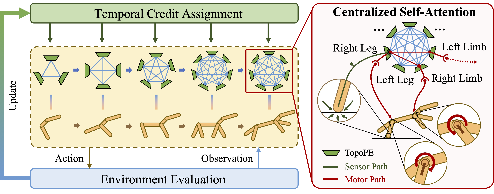

# Genesis: Embodiment Co-Design via Efficient Message and Reward Delivery

This is the codebase for Genesis: Embodiment Co-Design via Efficient Message and Reward Delivery.

<p align="center">
    <br>
    
    <br>
<p>

# Setup
Let's start with python 3.9. It's recommend to create a `conda` env:

## Create new conda env 
```
conda create -n Genesis python=3.9
conda activate Genesis
```

## Install for MuJoCo Simulator and mujoco-py
Install mujoco-py following the instruction [here](https://github.com/openai/mujoco-py#install-mujoco).

Set the following environment variable to avoid problems with multiprocess trajectory sampling:
```
export OMP_NUM_THREADS=1
```

(Optional) For MacOS user, you can follow the `README_FOR_MAC.md` to install MuJoCo on M1/M2/M3 Mac, which is helpful for embodied agents visualization.

## Install
```
pip install -r requirements.txt
```

Note you may have to follow https://pytorch.org/ setup instructions for installation on your own machine.

# Training and Visualization

Please refer to the [project webpage](genesisorigin.github.io) for more visualization results.

## Pretrained Models
We also provide pretrained models in `Genesis/pretrained_models` for visualization. 

* You can download pretrained models from [Google Drive](https://drive.google.com/file/d/1TYRl8FI8TWEkXr1wYGOsW0au--GUBnce/view?usp=sharing)

* Once the `pretrained_models.zip` file is downloaded, unzip it under the folder `Genesis` of this repo:
  ```
  unzip pretrained_models.zip
  ```

After you unzip the file, an example directory hierarchy is:
```
assets/
design_opt/
...
pretrained_models/
  |-- cheetah/
  |-- crawler/
  |-- ...
  |-- walker-regular/
...
scripts/
```


## Visualization

<p align="center">
    <br>
    
    <br>
<p>

If you have a GUI display, you can run the following command to visualize the pretrained model:
```
python design_opt/eval.py --train_dir <path_of_model_folder>
```

For example, you can use `pretrained_models` to visualize the co-design embodied agent on `cheetah` generated by Genesis:
```
python design_opt/eval.py --train_dir /Path/to/Genesis/pretrained_models/cheetah
```

You can press `S` to slow the agent, and `F` to speed up. 

## Training from Scratch
```
cd Genesis
chmod 777 scripts/Run_Genesis.sh
./scripts/Run_Genesis.sh
```
Use the scripts `scripts/Run_Genesis.sh`, which contain preconfigured arguments and hyperparameters for **all** the experiments in the paper.  Experiments use Hydra to manage configuration.

Visualizing results requires `wandb`: configure project name with the `project` key in `Genesis/design_opt/conf/config.yaml`.

As an example of how to run, this runs Genesis on the `crawler` environment:

```
EXPT="crawler"
OMP_NUM_THREADS=1 python -m design_opt.train -m cfg=$EXPT group=$EXPT
```

You can replace `crawler` with {`crawler`, `terraincrosser`, `cheetah`, `swimmer`, `glider-regular`, `glider-medium`, `glider-hard`, `walker-regular`, `walker-medium`, `walker-hard`} to train other environments.

- `OMP_NUM_THREADS=1` is essential to prevent CPU ops from hanging.

- The environment is selected with the `cfg=` flag, each of which corresponds to a YAML file in `Genesis/design_opt/cfg`. See that folder
for the list of available experiments.

- Other hyperparameters are explained in `Genesis/Genesis/design_opt/conf/config.yaml` and our paper.

# License
Please see the [license](LICENSE) for further details.